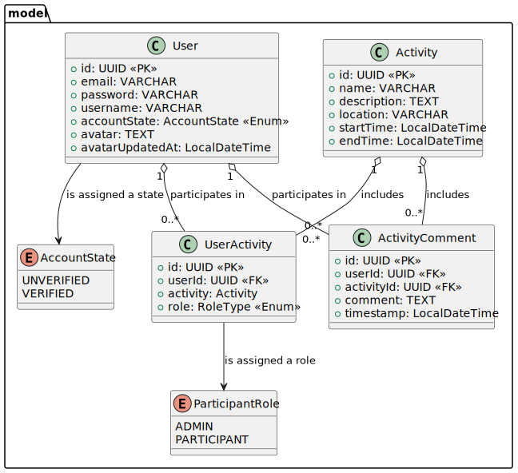

# Contents
- [GetActive](#SoloSavings)
- [Software Architecture](#software-architecture)
  - [Technology Stack and Frameworks](#technology-stack-and-frameworks)
- [Package Structure](#package-structure)

# GetActive

GetActive helps university students overcome the challenge of finding and joining social or recreational groups. It offers a platform to discover, create, and join on-campus activities, making it easier to build connections. Students can register, verify their accounts, and manage their participation in multiple activities. The goal is to promote an active, socially connected campus experience.

# Software Architecture  

The GetActive application is composed of modular components distributed across a client-server architecture. The system is decomposed into three main components: the frontend, the backend, and the database, each of which is containerized using Docker and deployed to a cloud platform such as Heroku. The architecture follows a layered design pattern within the backend and uses industry-standard frameworks and tools for development, deployment, and scalability.

### Technology Stack and Frameworks
* Frontend: React, HTML5, CSS3, Axios/Fetch API (for REST communication)
* Backend: Java, Spring Boot, Spring Security, Spring Data JPA
* Database: MySQL
* Authentication: JWT (JSON Web Tokens)
* Deployment: Docker, GitHub, Heroku
* Version Control: Git, GitHub

### Package Structure

## Class Diagram

## Database Diagram

